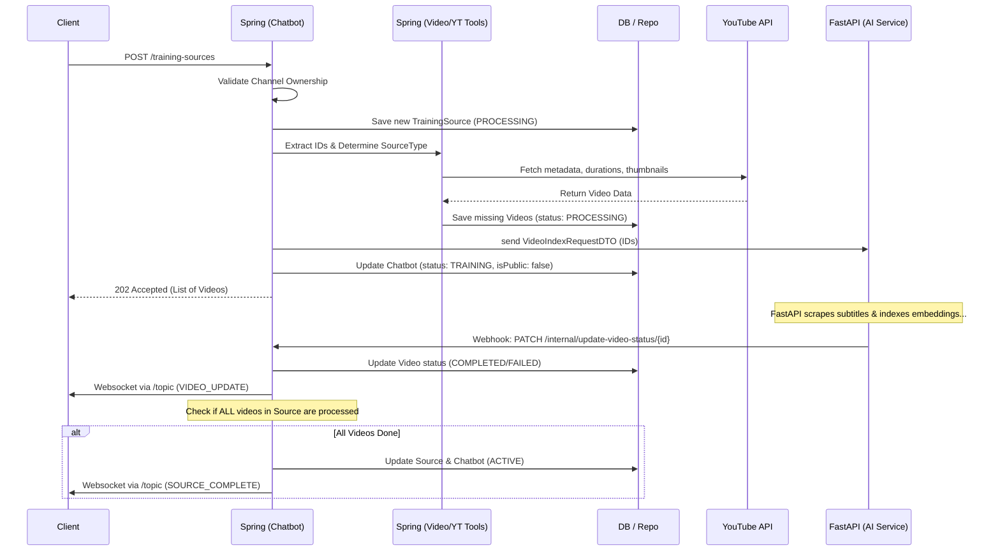

# Video Ingestion Flow in Replime Backend

This document outlines the end-to-step flow of how YouTube videos are ingested, validated, saved, and processed by the AI system when an influencer adds a new training source via the Spring Boot backend.

## 1. Request Interception
**Endpoint:** `POST /influencer/chatbot/training-sources`
**Controller:** `InfluencerChatbotController`

The process starts when the client sends a `TrainingSourceRequestDTO`. This payload contains:
- `sourceType`: The type of YouTube source (`VIDEO`, `PLAYLIST`, `LAST_N`, or `CHANNEL`).
- `sourceValue`: The URL or ID of the source.
- `last_n`: (Optional) The number of recent videos to fetch if `LAST_N` is selected.

## 2. Authentication & Ownership Validation
**Component:** `ChatbotService.addTrainingSourceToChatbot`

1. **Identify User & Chatbot**: The JWT token is parsed to find the `User` and their corresponding `Chatbot`.
2. **Ownership Check**: Before doing any processing, the system ensures the requested video/playlist actually belongs to the verified influencer. 
   - If the source type is `LAST_N`, it inherently pulls from the user's mapped channel, so it easily passes.
   - For `VIDEO` or `PLAYLIST`, `ChatbotService` consults the `InfluencerVerificationRepo` and uses `YoutubeClientService` to verify that the extracted entity's `channelId` matches the influencer's verified YouTube channel.
   - If validation fails, a `TrainingSourceException` (HTTP 403 Forbidden) is thrown.

## 3. Training Source Initialization
**Component:** `TrainingSourceService.addTrainingSourceToChatbot`

Once validated, a new `TrainingSource` entity is created in the database.
- It records the requested parameters.
- The `SyncStatus` is immediately set to `PROCESSING`.

## 4. YouTube Data Fetching & Database Persistence
**Component:** `VideoService.fetchAndSaveVideosForTrainingSource`
**Helper Provider:** `YoutubeClientService`

Depending on the `sourceType`, the system pulls the relevant video metadata:
- **`PLAYLIST`**: Extracts the playlist ID from the URL, queries the YouTube API for all video IDs in that playlist, and fetches their details in batches of 50.
- **`VIDEO`**: Extracts the specific video ID, ensures it doesn't already exist in the chatbot's knowledge base (`ALREADY_INGESTED` conflict), and fetches its details.
- **`LAST_N`**: Reads the user's verified `channelId` and queries the YouTube Search API (ordered by date) limit restricted by the `last_n` parameter.
- **`CHANNEL`** *(Used during initial config)*: Iterates through the API pagination to pull all video IDs of the channel.

**Saving**: 
The videos are mapped to `Video` entities (storing titles, duration, and thumbnails). Any video that isn't already stored in the DB is saved and linked to the `TrainingSource`. Each video starts with a `SyncStatus` of `PROCESSING`.

## 5. Triggering AI Indexing (FastAPI)
**Component:** `VideoService.indexSavedVideos` & `FastApiService`

After successfully persisting the new videos into the PostgreSQL database:
1. `VideoService` maps the saved items into a `VideoIndexRequestDTO`.
2. A request is made to the external Python `FastAPI` service via `FastApiService.indexVideos`.
3. The FastAPI microservice takes over from here to asynchronously download transcripts, chunk them, embed them, and store them in the vector database (Pinecone/Milvus, etc.).

## 6. Chatbot State Update
**Component:** `TrainingSourceService`

Back in the Spring Boot app, while the videos process:
- The `Chatbot.status` is set to `TRAINING`.
- The `Chatbot.isPublic` flag is temporarily flipped to `false`.
- A list of `VideoResponseDTO` representing the freshly detected videos is returned to the client.

## 7. Asynchronous Completion & WebSockets (Webhook)
**Components:** `InternalController`, `VideoService`, `SimpMessagingTemplate`

Because processing heavy transcripts takes time, FastAPI asynchronously pings the Spring Boot API when an individual video is finished (or fails):
1. **Webhook Endpoint:** `PATCH /internal/update-video-status/{videoId}` is hit by the AI microservice.
2. **Video Update:** `VideoService.updateVideoStatus` updates the video's `SyncStatus` (e.g., to `COMPLETED` or `FAILED`).
3. **Websocket Notification (Video Level):** A `SyncStatusMessageDTO` (type: `VIDEO_UPDATE`) is pushed to `/topic/chatbot/{chatbotId}/sync-status` to live-update the frontend UI.
4. **Source Completion Check:** The system then checks if all videos inside the `TrainingSource` are finished processing.
5. **Finalization:** If all are finished, the `TrainingSource` is marked `COMPLETED`. The `Chatbot` is restored to `ACTIVE` and `isPublic = true`. A final `SOURCE_COMPLETE` websocket message is broadcasted.

---

## 📌 Flow Diagram 

